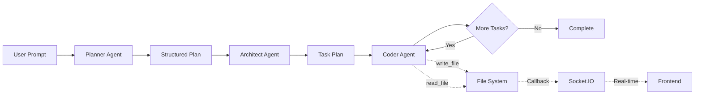

# 🚀 Brahmastra Coder - AI Agentic Project Generator

[](https://www.python.org/)
[](https://langchain-ai.github.io/langgraph/)
[](https://python.langchain.com/)
[](https://groq.com/)
[](https://nextjs.org/)
[](https://fastapi.tiangolo.com/)
[](LICENSE)

## Project Overview
**Brahmastra Coder** is an advanced **Agentic AI** full-stack application that generates complete projects from natural language descriptions. Built with **LangGraph** multi-agent orchestration and powered by **Groq LLM**, it features real-time visualization of AI code generation with live preview capabilities.

### 🤖 Agentic AI Architecture
This project leverages cutting-edge AI agent technology:
- **LangGraph**: Multi-agent workflow orchestration and state management
- **LangChain**: Agent framework and tool integration
- **Groq**: Ultra-fast LLM inference (openai/gpt-oss-120b model)
- **Three-Agent Pipeline**: Planner → Architect → Coder workflow
- **ReAct Agent Pattern**: Tool-using agent with reasoning capabilities

---

## ✨ Core Features

### 1. **AI Project Generation**
- **Natural Language Input**: Describe any project idea in plain English
- **Three-Agent System**: 
  - **Planner Agent**: Converts user prompt into structured plan
  - **Architect Agent**: Creates detailed task breakdown and file structure
  - **Coder Agent**: Implements each task with file operations
- **LangGraph Orchestration**: Reliable multi-agent workflow with conditional edges
- **Groq LLM**: Lightning-fast inference with advanced reasoning
- **Multiple File Types**: HTML, CSS, JavaScript, Python, and more
- **Smart File Organization**: Proper folder structure and file placement

### 2. **Real-Time Visualization**
- **WebSocket Streaming**: Live updates via Socket.IO
- **File Operation Display**: See files being created/updated in real-time
- **Activity Log**: Timestamped log of all agent actions
- **Status Indicators**: Visual feedback at every step
- **Connection Monitoring**: Shows connected/disconnected state

### 3. **Inline Preview System** 🆕
- **View Mode Toggle**: Seamless switch between Code and Preview
- **Light/Dark Themes**: Theme switcher for preview mode
- **Inline Rendering**: Preview stays in same page (no new windows)
- **Multi-File Support**: Dropdown to switch between HTML pages
- **Asset Loading**: Automatic path rewriting for CSS/JS/images
- **Interactive Preview**: Fully functional iframe with sandboxing

### 4. **Code Editor**
- **Monaco Editor**: VS Code's editor engine
- **Syntax Highlighting**: 20+ languages supported
- **Line Numbers**: Professional code display
- **Read-Only View**: Safe viewing of generated code
- **File Navigation**: Click any file to view contents

### 5. **File Explorer**
- **Tree View**: Hierarchical folder/file structure
- **Expand/Collapse**: Navigate nested directories
- **File Selection**: Click to view in editor
- **Real-Time Updates**: Files appear as they're created
- **Visual Icons**: Folder and file icons for clarity

### 6. **Smart Notifications**
- **Completion Toast**: Animated notification on success
- **Quick Actions**: Preview and Open Folder buttons
- **Auto-Dismiss**: Disappears after 10 seconds
- **Slide-In Animation**: Smooth entrance from right
- **File Count**: Shows number of files generated

### 7. **Project Management**
- **Open Folder**: Opens generated_project in file explorer
- **Multi-Platform**: Works on Windows, macOS, Linux
- **File Serving**: Backend serves all project assets
- **Download/Export**: Copy entire project folder

---

## 🏗️ Architecture

### Backend (Python + LangGraph)
```
FastAPI + Socket.IO + LangGraph
├── api/server.py           # Main API server
│   ├── Socket.IO Events    # Real-time communication
│   ├── REST Endpoints      # File operations
│   └── Static File Serving # Asset delivery
│
├── agents/
│   ├── graph.py            # LangGraph multi-agent workflow
│   │   ├── Planner Agent   # Structured planning with Pydantic
│   │   ├── Architect Agent # Task decomposition
│   │   └── Coder Agent     # ReAct agent with tools
│   ├── prompts.py          # Agent system prompts
│   ├── states.py           # Pydantic data models
│   └── tools.py            # LangChain tools (read/write files)
│
└── generated_project/      # Output directory
```

### Frontend (Next.js + TypeScript)
```
Next.js 14 App Router
├── app/
│   ├── layout.tsx          # Root layout
│   ├── page.tsx            # Main application
│   ├── preview/page.tsx    # Separate preview page
│   └── globals.css         # Global styles + animations
│
├── components/
│   ├── PromptInput.tsx           # Project description input
│   ├── FileExplorer.tsx          # File tree view
│   ├── CodeEditor.tsx            # Monaco code editor
│   ├── InlinePreview.tsx         # 🆕 Iframe preview
│   ├── ViewModeSwitcher.tsx      # 🆕 Code/Preview toggle
│   ├── ActivityLog.tsx           # Real-time activity feed
│   ├── StatusBar.tsx             # Status indicator
│   ├── CompletionNotification.tsx # Success toast
│   └── PreviewButton.tsx         # Preview action button
│
└── hooks/
    └── useProjectGeneration.ts   # WebSocket client hook
```

---

## 💻 Technology Stack

### 🤖 AI & Agent Framework
| Technology | Purpose | Version |
|-----------|---------|---------|
| **LangGraph** | Multi-agent orchestration & state management | 0.6.3+ |
| **LangChain** | Agent framework & tool integration | 0.3.27+ |
| **Groq** | Ultra-fast LLM inference | 0.31.0+ |
| **LLM Model** | `openai/gpt-oss-120b` | Latest |

### 🔧 Backend Stack
| Technology | Purpose | Version |
|-----------|---------|---------|
| **FastAPI** | REST API framework | 0.115.0 |
| **Socket.IO** | WebSocket real-time communication | 5.11.0 |
| **Uvicorn** | ASGI server | 0.32.0 |
| **Pydantic** | Data validation & serialization | 2.11.7+ |
| **Python** | Runtime | 3.11+ |

### 🎨 Frontend Stack
| Technology | Purpose | Version |
|-----------|---------|---------|
| **Next.js** | React framework | 14.2.18 |
| **React** | UI library | 18.3.1 |
| **TypeScript** | Type safety | 5.6.2 |
| **Tailwind CSS** | Styling | 3.4.1 |
| **Monaco Editor** | Code editor (VS Code engine) | 4.6.0 |
| **Socket.IO Client** | WebSocket client | 4.8.1 |
| **Lucide React** | Icon library | 0.454.0 |

### 🔄 Agent Workflow


---

## 🎨 User Interface

### Layout (Code View)
```
┌──────────────────────────────────────────────────────────┐
│  🎯 Brahmastra Coder    [Code] Preview ☀️     ● Connected│
├──────────────────────────────────────────────────────────┤
│ ┌──────────┬──────────┬───────────────────────────────┐ │
│ │ Prompt   │  Files   │   Monaco Code Editor          │ │
│ │ ────────-│  ├─ 📁   │   ┌─────────────────────────┐ │ │
│ │ [Text    │  ├─ 📄   │   │ 1  <!DOCTYPE html>      │ │ │
│ │  Area]   │  ├─ 📄   │   │ 2  <html>               │ │ │
│ │          │  └─ 📄   │   │ 3    <head>             │ │ │
│ │ [Generate│          │   │ ...                     │ │ │
│ │  Button] │          │   └─────────────────────────┘ │ │
│ ├──────────┤          │                               │ │
│ │ Activity │          │                               │ │
│ │ Log      │          │                               │ │
│ │ • Log 1  │          │                               │ │
│ │ • Log 2  │          │                               │ │
│ └──────────┴──────────┴───────────────────────────────┘ │
├──────────────────────────────────────────────────────────┤
│ ✅ Project generated successfully                         │
└──────────────────────────────────────────────────────────┘
```

### Layout (Preview View - Light Theme)
```
┌──────────────────────────────────────────────────────────┐
│  🎯 Brahmastra Coder    Code [Preview] 🌙  ● Connected   │
├──────────────────────────────────────────────────────────┤
│ ┌──────────┬──────────┬───────────────────────────────┐ │
│ │ Prompt   │  Files   │   📄 index.html      🔄 ↗     │ │
│ │ ────────-│  ├─ 📁   │   ┌─────────────────────────┐ │ │
│ │ [Text    │  ├─ 📄   │   │                         │ │ │
│ │  Area]   │  ├─ 📄   │   │  [Rendered Website]     │ │ │
│ │          │  └─ 📄   │   │  Light background       │ │ │
│ │ [Generate│          │   │  Interactive content    │ │ │
│ │  Button] │          │   │                         │ │ │
│ ├──────────┤          │   └─────────────────────────┘ │ │
│ │ Activity │          │                               │ │
│ │ Log      │          │                               │ │
│ │ • Log 1  │          │                               │ │
│ │ • Log 2  │          │                               │ │
│ └──────────┴──────────┴───────────────────────────────┘ │
├──────────────────────────────────────────────────────────┤
│ ✅ Project generated successfully                         │
└──────────────────────────────────────────────────────────┘
```

---

## 🚀 Complete Usage Flow

### Step 1: Start Services
```bash
# Terminal 1: Backend
cd "c:\Users\SURAJ\Documents\5clear chatapp\AI SE"
.\.venv\Scripts\activate
python -m uvicorn api.server:socket_app --reload

# Terminal 2: Frontend (after npm install)
cd frontend
npm run dev
```

### Step 2: Generate Project
1. Open http://localhost:3000
2. Enter prompt: *"Create a todo app with HTML, CSS, and JavaScript"*
3. Click "Generate Project"
4. Watch real-time updates:
   - Activity log shows agent actions
   - Files appear in explorer as created
   - Status bar shows progress

### Step 3: View Results
**Option A: Code View (Default)**
- Click any file in explorer
- View code with syntax highlighting
- Browse all generated files

**Option B: Preview View (HTML Projects)**
- Click "Preview" in header or notification
- See rendered website instantly
- Toggle light/dark theme
- Switch between HTML pages (if multiple)
- Click "Code" to return to code view

**Option C: Open Folder**
- Click "Open Folder" button
- Browse files in file explorer
- Copy/use files in other projects

---

## 🎯 Example Projects

### 1. Landing Page
```
Prompt: "Create a modern landing page with hero section, features, and footer"

Generated:
├── index.html       (Hero, features, footer sections)
├── styles.css       (Modern styling, responsive design)
└── script.js        (Smooth scroll, animations)

Preview: ✅ Perfect rendering
Theme: Both light/dark work well
```

### 2. Todo Application
```
Prompt: "Create a todo app with HTML, CSS, and vanilla JavaScript"

Generated:
├── index.html       (Input, list, filters)
├── style.css        (Clean UI, buttons, hover effects)
└── app.js           (Add, delete, mark complete, filter)

Preview: ✅ Fully functional
Theme: Dark mode recommended
```

### 3. Calculator
```
Prompt: "Create a calculator app with HTML, CSS, and JavaScript"

Generated:
├── index.html       (Display, number buttons, operators)
├── calculator.css   (Grid layout, button styling)
└── calculator.js    (Calculation logic, display updates)

Preview: ✅ Interactive and working
Theme: Both themes work
```

### 4. Portfolio Website
```
Prompt: "Create a personal portfolio with about, projects, and contact sections"

Generated:
├── index.html       (Multi-section layout)
├── about.html       (Optional separate page)
├── projects.html    (Optional separate page)
├── styles.css       (Professional styling)
└── main.js          (Navigation, scroll effects)

Preview: ✅ Multi-page support via dropdown
Theme: Light mode for professional look
```

---

## 📊 Technical Specifications

### Backend
- **Framework**: FastAPI 0.115.0
- **WebSocket**: python-socketio 5.11.0
- **LLM**: Groq (openai/gpt-oss-120b)
- **Agent Framework**: LangChain + LangGraph
- **Server**: Uvicorn ASGI
- **Language**: Python 3.11+

### Frontend
- **Framework**: Next.js 14.2.18
- **Language**: TypeScript 5
- **Styling**: Tailwind CSS 3.4
- **Editor**: Monaco Editor (VS Code engine)
- **Real-time**: Socket.IO Client 4.8
- **Icons**: Lucide React 0.454
- **Build Tool**: Next.js built-in

### Dependencies
```json
Backend (api/requirements.txt):
- fastapi==0.115.0
- uvicorn[standard]==0.32.0
- python-socketio==5.11.0
- pydantic==2.9.2
- aiofiles==23.2.1

Frontend (package.json):
- next: 14.2.18
- react: ^18.3.1
- typescript: ^5
- @monaco-editor/react: ^4.6.0
- socket.io-client: ^4.8.1
- lucide-react: ^0.454.0
- tailwindcss: ^3.4.1
```

---

## 🔒 Security Features

1. **Path Validation**: All file operations validate paths are within PROJECT_ROOT
2. **Sandboxed Preview**: Iframe with limited permissions
3. **CORS Configuration**: Restricted to localhost:3000
4. **Input Sanitization**: Prompts and file paths validated
5. **Read-Only Editor**: Generated code can't be edited (prevents accidents)

---

## 📚 Documentation Files

1. **README.md** - Project overview and quick start
2. **SETUP_GUIDE.md** - Complete installation and setup instructions
3. **frontend/README.md** - Frontend-specific documentation
4. **PREVIEW_FEATURE.md** - Original preview feature (separate window)
5. **PREVIEW_QUICKSTART.md** - Quick reference for preview usage
6. **INLINE_PREVIEW_GUIDE.md** - 🆕 Inline preview and theme switcher guide
7. **This file** - Complete feature summary

---

## 🎯 Key Differentiators

### vs Other AI Code Generators:
✅ **Real-time visualization** - See files being created live
✅ **Inline preview** - No context switching
✅ **Theme options** - Light/dark preview modes
✅ **File explorer** - Always-visible project structure
✅ **Activity logging** - Full transparency of agent actions
✅ **Instant results** - No waiting for download/export

### Lovable.dev Inspired Features:
✅ File-by-file creation display
✅ Real-time activity feed
✅ Inline preview rendering
✅ Professional UI/UX
✅ Smooth animations
✅ Completion notifications

---

## 🚧 Current Limitations

1. **Static HTML Only**: Preview works best with client-side code
2. **No Live Reload**: Must manually refresh after file changes
3. **Single User**: No multi-user collaboration (yet)
4. **Local Only**: Requires backend running locally
5. **No Editing**: Can't edit files in the UI (view only)

---

## 🔮 Future Roadmap

### Phase 1 (Near-term)
- [ ] File editing capabilities
- [ ] Live reload on file changes
- [ ] Split view (code + preview side-by-side)
- [ ] Project history/versions
- [ ] Download as ZIP

### Phase 2 (Mid-term)
- [ ] Multi-user collaboration
- [ ] Cloud deployment
- [ ] Authentication system
- [ ] Project templates library
- [ ] Git integration

### Phase 3 (Long-term)
- [ ] Deploy to hosting (Vercel/Netlify)
- [ ] Responsive preview modes
- [ ] JavaScript console in preview
- [ ] Network inspector
- [ ] Performance metrics

---

## 💡 Best Practices

### For Users:
1. **Be Specific**: Detailed prompts yield better results
2. **Start Simple**: Begin with basic projects, increase complexity
3. **Check Activity Log**: Monitor agent progress
4. **Use Preview**: Instantly see HTML projects rendered
5. **Test Themes**: Try both light/dark modes
6. **Open Folder**: Access files for further development

### For Developers:
1. **Keep Backend Running**: Frontend needs API connection
2. **Monitor Console**: Check for errors in browser/terminal
3. **Clear Cache**: If preview doesn't update, clear browser cache
4. **Check Groq Limits**: Free tier has rate limits
5. **Backup Projects**: Copy important projects from generated_project/

---

## 📊 Performance Metrics

- **Generation Time**: 30s - 2min (depends on project complexity)
- **File Operations**: Real-time streaming (< 100ms latency)
- **Preview Load**: < 1s for most HTML projects
- **Theme Switch**: Instant (no reload needed)
- **View Toggle**: Instant (no reload needed)

---

## 🎓 Learning Resources

### Tutorials
1. Read SETUP_GUIDE.md for installation
2. Try example prompts from this document
3. Explore generated code in editor
4. Test preview with different themes
5. Read INLINE_PREVIEW_GUIDE.md for advanced usage

### Example Prompts Library
See `PREVIEW_QUICKSTART.md` for more example prompts

---

## 🙏 Acknowledgments

- **LangChain** - Agent framework
- **LangGraph** - Agent orchestration
- **Groq** - Fast LLM inference
- **FastAPI** - Modern Python web framework
- **Next.js** - React framework
- **Monaco Editor** - VS Code editor
- **Tailwind CSS** - Utility-first CSS
- **Lucide** - Beautiful icons
- **Socket.IO** - Real-time communication

---

## 📞 Support

For issues or questions:
1. Check documentation files
2. Review error messages in console
3. Verify backend is running
4. Check Groq API key is valid
5. Open GitHub issue with details

---

## 🎉 Summary

**Brahmastra Coder** is a complete, production-ready AI project generator with:
- ✅ Real-time file operation visualization
- ✅ Inline preview with theme switcher
- ✅ Professional code editor
- ✅ Interactive file explorer
- ✅ Smart notifications
- ✅ Multi-platform support
- ✅ Comprehensive documentation

**Ready to use!** Just install dependencies and start generating amazing projects with AI! 🚀
